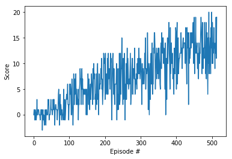

### Report for Project 1 - Navigation

## Learning Algorithm

The learning algorithm used was a Deep Q Network with an underlying neural network using three 64-unit fully connected layers and relu activation functions.

The hyperparameters used to train the agent were as follows:
  - BATCH_SIZE = 64     (training batch size)
  - GAMMA = 0.99        (discount factor)
  - TAU = 0.001         (interpolation parameter for soft update of target parameters)
  - LR = 0.0005         (learning rate)
  - UPDATE_EVERY = 4    (how often to update the network)

## Plot of Rewards

The following is a plot of the rewards for the trained agent showing the 414 episodes it took to solve the problem. Over the last 100 episodes, the average score was 13.01:

## Ideas for Future Work

The initial implementation was able to solve the task fairly quickly, but further optimization of hyperparameters could result in a quicker solution.

